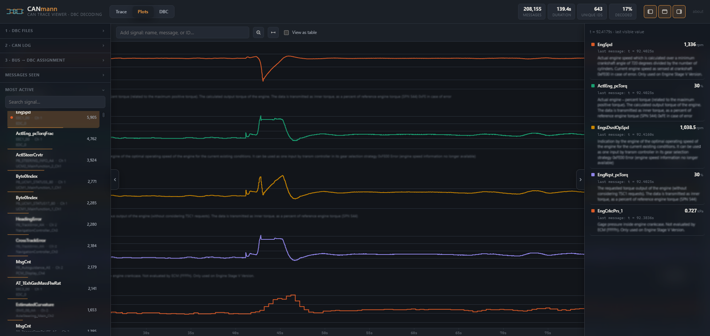

# CANmann — CAN Trace Viewer

A desktop/browser tool for inspecting CAN bus logs: decodes every message using **DBC** files and lets you explore the trace and plot signals over time.

It's a single self-contained HTML file (`can_viewer.html`) — no install, no build step, no external dependencies. Open it straight in the browser and everything runs locally: no loaded file (DBC, CSV, ASC) ever leaves your machine.

## Usage

1. Open `can_viewer.html` in Chrome/Edge (needs `<input type="file">`, drag & drop, Canvas 2D).
2. **DBC files**: load one or more `.dbc` files. Every file you load is remembered across sessions (IndexedDB), so it stays listed — and available in the bus dropdowns below, with your last assignment pre-selected — even after closing and reopening the app.
3. **CAN log**: load a `.csv` (format `Timestamp,CAN_ID,DLC,Data`, the one `CANmann.py` produces) or an `.asc` (Vector ASCII).
4. Assign one DBC per bus under **Bus → DBC Assignment** — only an assigned DBC is used to decode that bus's messages.

## Trace tab

- Virtualized table (handles hundreds of thousands of messages without lag), with filtering by ID/name/channel — `*` works as a wildcard, Escape clears it — and a "decoded only" toggle.
- Decoded signal panel when a message is selected: physical value, raw value, unit, `VAL_` table labels, multiplexing (including extended/cascaded multiplexors, `SG_MUL_VAL_`), DBC comments, and a warning when a multi-packet J1939 message (e.g. DM1) exceeds the 8 bytes of the captured frame. Right-click a signal to add/remove it from the Plots area, or to copy its name (or its message's).
- Trace playback with a speed control.
- "Messages Seen" list sorted by frequency, with a green/red indicator for decoded vs. unknown, each message's channel and source, and search by any of those (name, ID, or source — `*` works as a wildcard, Escape clears it). Right-click a message or signal name to copy it.
- "Most Active": ranks signals by how many times their value actually changed — not just how often the message was transmitted — showing each signal's channel and source too, with its own search box (same wildcard/Escape behavior). In Plots, clicking a row adds/removes it from the chart, and right-click also offers "Explore message" (jump to it in "Messages Seen"). In Trace, clicking a row filters to that signal's message instead — the same as clicking it in "Messages Seen" — and right-click offers "Insert in plot area" in place of "Explore message". Either tab's menu can also filter the list down to just that message's signals, or copy its message/signal name.

## Plots tab

- Pick any DBC-recognized signal (from the message list, the "Most Active" panel, or the search box — each showing its message, channel, and source; the search box also takes `*` as a wildcard, Escape clears/closes it) and it's added as its own stacked lane labeled with its message and source, with its own Y axis.
- Step line (a CAN signal holds its value until the next message).
- Synchronized cursor across every lane, with a readout panel showing each signal's value (with its unit and DBC description) and the real timestamp of its last message — each lane's own header mirrors that value and unit for at-a-glance reading. Drag a readout row to reorder its lane, or click it to jump straight there.
- Mouse-wheel zoom and horizontal drag-to-pan; vertical drag to scroll through lanes that don't fit on screen.
- Alternative table view for each signal.
- Measure the time between two points: click the ruler button, then click two spots on any chart to see the elapsed time between them.
- Set a trigger on a lane (a numeric threshold, or a specific `VAL_` label for enum-like signals) and step through every occurrence where the signal enters that condition — the view pans to center each one.

## DBC Edit tab

- Create a DBC from scratch or open an existing one to edit — independent of the DBC files loaded for decoding in the other tabs.
- Add/edit/delete messages, signals, nodes (`BU_`), and value tables (`VAL_TABLE_`), including start bit, length, byte order, signed/unsigned, factor/offset, min/max, unit, multiplexing, and receivers.
- Per-signal value tables (`VAL_`) with raw-value range validation tied to the signal's own bit width.
- Search messages and signals by name, ID, or signal (`*` works as a wildcard, Escape clears it).
- Vector/J1939 attributes (`BA_`/`BA_DEF_`) on messages, signals, and nodes, with hover hints for common J1939 attribute names.
- Save writes a `.dbc` file (Windows-1252 encoded) via the native file picker where supported, or a download otherwise.
- Check "Read-only" before opening a file to browse it without risking any edit — every field is disabled and Save is hidden. This preference persists across files.
- "Close" discards the open file and returns to the empty state (asks for confirmation if there are unsaved changes).
- Experimental — keep a backup of any `.dbc` file before editing and saving it.

## Interface

- Light/dark theme follows the OS preference automatically.
- Toggle the left panel, toolbar, and right panel independently to make room on smaller screens.

## Supported file formats

| File | Format |
|---|---|
| DBC | Windows-1252, standard syntax (`BO_`, `SG_`, `VAL_`, `CM_`), including extended/cascaded multiplexing (`SG_MUL_VAL_`) and floating-point signals (`SIG_VALTYPE_`) |
| Log | `.csv` (`Timestamp,CAN_ID,DLC,Data`) or `.asc` (Vector ASCII, multi-channel) |

Bit-level decoding (Intel/Motorola, signed values, multiplexing, multi-packet message truncation) was validated against [`cantools`](https://github.com/cantools/cantools) before the first version shipped, and against real production DBC files since.

The app checks its own GitHub repo on startup and shows a banner if a newer version is available; updating overwrites the local file in place (or downloads it, in browsers without that capability).

## Known limitations

- Doesn't read raw `.blf` binary files — Vector BLF uses compressed containers in a proprietary format. Convert to `.csv` or `.asc` first (for example with `python-can`).
- Built for desktop Chrome/Edge; not optimized for mobile.
